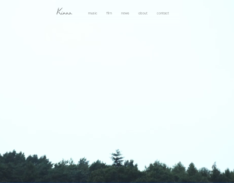

# kinna-music.github.io



## Introduction

This is a project that uses Jekyll to generate a set of github.io web pages. After every push to the "Master" branch, Github kindly runs Jekyll and serves up the pages. These pages can then be visited at <https://www.kinna.co.uk>. 

The certificate for this is produced by Cloudflare who also proxy the site.

If you have any difficulties with this site then please contact Roland. If you don't have Roland's details, just complete an issue and he will get back to you. If you need help with creating an issue, Github has lots of help pages for you to read!

## Running it locally

If you want to run this site locally then you will need to install Ruby and Jekyll on your machine. For help doing this, please visit <https://jekyllrb.com>. There is plenty of documentation and, as an active tool, there is tonnes of support on [stackoverflow](https://www.stackoverfow.com) and on other developer sites.

You will need to copy the project locally:


``` bash
git clone git@github.com:kinna-music/kinna-music.github.io.git

```

or use [github.com](https://github.com/kinna-music/kinna-music.github.io) to help you clone it.

Before you make any changes, create a branch from _master_ and commit all your changes to that branch. When you have completed that, create a pull request to merge your changes to _master_. Again, this is easiest done on the [github.com](https://github.com/kinna-music/kinna-music.github.io) site.

To test your changes locally, open up a terminal window (using terminal, iTerm or even the terminal in VSCode) and, from with the project directory, run:

``` bash
jekyll clean && jekyll serve -w
```

This will clean out previous builds and will then update your local version every time you save a page.

### Notes on markdown

Although kramdown github flavoured markdown is pretty well adhered to in this system, sometimes it doesn't work. If you want to add bold in your page content you could try adding ```**``` before and after the text to be emboldened but if it doesn't work, simply write it as html: ```<b>your bold text</b>```. Likewise, with italics, try ```_``` before and after or fall back on html: ```<i>your italic text</i>```.

## Project structure

Assuming that you are not making changes to the design or functionality of the site, there are 3 subdirectories containing markdown files with YAML headers:

* _music
* _film
* _news

There is also a directory called _unused into which you can put stuff that won't be built into the site.

### _music

The music directory is for pages that will appear under the ["music"](https://kinna.co.uk/music) banner. There is an index page which should rebuild every time that you add a new page.

The YAML at the top of the page (in the area designated by ```---```) should be as follows:

``` yaml
---
layout: music <- do not change
title: track or 
date: 7/12/2023
publish: true | false
order: 10
summary: a short 15 word summary of the page
bandcamp: 
bandcamp-album-no: 
spotify:
applemusic: 
soundcloud:
soundcloud-track-no:
default-source: soundcloud | bandcamp | spottify | applemusic
image: the image url
---

```
**Do not** change the first line which should always read "layout: music" for music entries. Otherwise the page won't render properly.

Title and date are pretty obvious but put the year in with the century.

Publish indicates if the page should be published or not. It should either be ```true``` or ```false```.

The order is a number that is used to determine the order of the tracks or albums. The higher the number, the further up the list that track will appear (so track 1 will be at the bottom). I tend to use multiple of 10 so that if you suddenly want to squeeze something in the middle, say between entries with order 40 and 50, you can add a 45.

The summary appears in the meta data of the page and is what Google etc will use to help people find your page. Keep it short, keep it succinct.

There then follows a list of music sites, [Bandcamp](https://bandcamp.com) to [Soundcloud](https://soundcloud.com/kinnamusic). Enter here the name of the track or album as it appears on the site. So, for Bandcamp adding in, for example, ```the-circle-live-album``` will produce a link to <https://kinna.bandcamp.com/album/the-circle-live-album>. If you have a value in these lines then the appropriate service logo will appear under the image with links to the track/album on that service so do make sure that you have the right album/track name entered.

Only one of bandcamp-album-no or soundclous-track-no should have a value. This is the embed code so that we can plat that track on our site without leaving. Of course we do want to be using the bandcamp-album-no because that is going to encourage people to pay!

_how to get the embed code_

Finally, there is an image url. The maximum size of the image is 700px x 700px. You could either link to a remote image or upload an image into the ```/static/images/music``` directory. If you use the [Quru Image Server](https://images.quru.com/list/?path=/kinna) then please don't forget to add ```&width=700``` to the image path.

You can put any text under the lower three dashes (```---```) and this will be rendered as the copy below the image. You can use [markdown](https://www.markdownguide.org/) or [html](https://www.w3schools.com/html/html_intro.asp) codes to format it. Two line returns will start a new paragraph.

### film

This fairly obviously follows the style of music.

``` yaml
---
layout: film
title: Lights
date: 01/08/2023
publish: true
order: 10
summary: Lights was displayed at the Royal Academys 2023 Summer Exhibition and was chosen for the Under-35 Arts Club Award.
description: Kinna has been producing exciting fims.
image: "/static/images/film/lights.jpg"
youtube-url: "https://www.youtube.com/embed/8VqQ-mX7kyk?si=EKi0TKoeZCx5c2jZ"
---

```

Here, layout must be "film".

In addition to the summary there is a descripton. This will also be used in the meta data and so can be a little longer than the summary.

The maximum width of the image should be 700px again. Height doesn't really matter but don't make it too big!

The youtube-url is the embed code, not the youtube url.

### news

The big difference here is that the news is just an index page (although separate news pages are generated but just not linked to on the site). Therefore the order is really important.

``` yaml
---
layout: news
title: Her Revelation Debut EP
date: 30/12/2023
publish: true
order: 1
tags:
  - film
summary: Kinna sofar gig her revelation her rev new music electronic band singing debut ep new announcement release
description: Her Revelation debut ep announcement
image: ///images.quru.com/image?src=/kinna/news/Group3_1.64.1.jpg&width=126&right=0.93438&left=0.06875
youtube-url:
---

```

Again, keep the layout as "news".

The order of the index is by date (most recent at the top) so the order field does not really matter.

Tags are not currently used but if we get lots of bits of news then they will kick into use to filter down the news items. Tags are a simple list (so indented and with a hyphen in front) so could be from:

* film
* music
* events

although other tags could be used in the future. You can have as many of the tags as you think are appropriate.

The image should only be 126px wide. The one shown is an example from the Quru Image Server.

The youtube-url is again an embed url rather than the page url and may be used to add an event promo video or similar.

## Todo

If you have things that need done, please create and issue.


